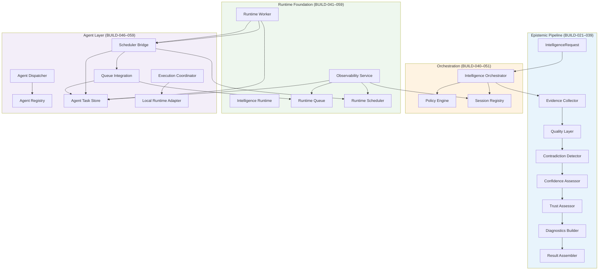

# BUILD-060 — Enterprise Alpha Final Integration & Release Audit

**Build:** BUILD-060  
**Date:** July 2026  
**Scope:** Final architecture audit and certification for Cloudflare Enterprise Alpha deployment  
**Status:** Complete — milestone release; no major new features

---

## Executive Summary

BUILD-060 certifies the CBAI Enterprise Intelligence platform after **39 sequential foundation builds** (BUILD-021 through BUILD-059). The audit confirms that the Intelligence Engine, epistemic pipeline, Runtime layer, Agent layer, Observability layer, and Test Harness form a **coherent, deterministic, Cloudflare-compatible architecture** suitable for the first Enterprise Alpha deployment.

**Verdict:** The platform is **certified for Cloudflare Pages Enterprise Alpha deployment** with documented limitations. External AI providers, graph/memory backends, and document ingestion remain intentionally disconnected. Runtime Worker coordination exists as a caller-driven abstraction and is not yet wired into the Orchestrator execution path.

| Score | Value | Meaning |
|-------|-------|---------|
| **Architecture Score** | **87 / 100** | Strong layering, consistent patterns, minor export/coupling gaps |
| **Enterprise Readiness Score** | **79 / 100** | Alpha-ready on Cloudflare; known gaps in backends and end-to-end agent wiring |

---

## Architecture Diagram

**Integration seams (intentional, not fully wired):**

- Orchestrator → Agent dispatch/execution/worker: **not connected** (alpha scope)
- Graph / Memory / Document adapters: **not connected** (placeholder responses)
- OpenAI / Anthropic / Gemini: **stub contracts only**

---

## Completed Foundation

### Audit checklist (BUILD-021 → BUILD-059)

| Component | Build | Status | Notes |
|-----------|-------|--------|-------|
| Intelligence Engine | 022–039 | ✓ | Pipeline delegates to Orchestrator |
| Evidence Pipeline | 023–033 | ✓ | Entity adapters live; document/search/graph partial |
| Quality | 024–031 | ✓ | Integrated into evidence and confidence |
| Contradictions | 025 | ✓ | Rule-based detection |
| Confidence | 026–031 | ✓ | Multi-factor assessment |
| Trust | 027–031 | ✓ | Governance gates active |
| Diagnostics | 028–038 | ✓ | Health, issues, builder |
| Runtime | 041 | ✓ | Session lifecycle |
| Policy | 044–051 | ✓ | Wired into Orchestrator |
| Session Registry | 045–051 | ✓ | Wired into Orchestrator |
| Queue | 042–056 | ✓ | Agent queue integration |
| Scheduler | 043–057 | ✓ | Agent scheduler bridge |
| Worker | 059 | ✓ | Caller-driven abstraction |
| Agent Registry | 046–048 | ✓ | Capability catalog |
| Agent Runtime Contract | 047–055 | ✓ | Local adapter connected |
| Agent Task | 048–052 | ✓ | Lifecycle + store |
| Task Store | 052 | ✓ | In-memory CRUD + snapshots |
| Dispatcher | 049–053 | ✓ | Capability matching |
| Execution Coordinator | 054–055 | ✓ | Local execution only |
| Local Runtime Adapter | 055 | ✓ | Deterministic placeholder |
| Observability | 058 | ✓ | Read-only snapshots |

**Documentation:** 38 numbered build reports (021–059) plus `build-050-enterprise-alpha-report.md` and `build-030a-entity-intelligence-adapter-design.md`.

**Test Harness:** **34 scenarios** (33 prior + `worker-process-next` added in BUILD-060 audit).

---

## Runtime Readiness

| Capability | Alpha Status |
|------------|--------------|
| Session lifecycle | Ready |
| Policy enforcement | Ready — wired in Orchestrator |
| Session registry | Ready — wired in Orchestrator |
| Queue | Ready — tested via agent integration |
| Scheduler | Ready — tested via scheduler bridge |
| Worker | Ready — abstraction only; external caller required |
| Observability | Ready — not UI-wired |

**Cloudflare compatibility:** No Node built-ins (`fs`, `path`, `crypto`), no browser APIs, no in-library timers or polling. Pure TypeScript suitable for Workers/Pages.

**Caveats:**

- In-memory state is **not durable** across isolate restarts — external Durable Object or KV required for persistence (future).
- Sequence counters reset per isolate — documented in BUILD-059.
- Worker must be invoked explicitly — no background processing in-library.

---

## Agent Readiness

| Capability | Alpha Status |
|------------|--------------|
| Agent registry | Ready |
| Task store | Ready |
| Dispatch integration | Ready — tested in isolation |
| Queue integration | Ready |
| Scheduler bridge | Ready |
| Execution (local) | Ready — deterministic placeholder |
| Execution (cloud AI) | Not ready — stubs only |
| End-to-end orchestrator → agent | Not wired |

**Local runtime adapter** provides the only connected execution path. Stub backends for OpenAI, Anthropic, and Gemini remain reserved.

---

## Remaining Technical Debt

| Priority | Item | Impact |
|----------|------|--------|
| High | Wire Worker → dispatch → execution into Orchestrator | End-to-end agent pipeline |
| High | Connect graph adapter | Graph-enabled requests return placeholders |
| High | Connect memory store | Memory-enabled requests return placeholders |
| Medium | Document ingestion adapter | Evidence gap for document sources |
| Medium | Root export parity with submodule barrels | Consumer import friction |
| Medium | Runtime ↔ agents bridge documentation | BUILD-050 diagram outdated |
| Low | Duplicate `trace.types` export blocks | Fixed in BUILD-060 |
| Low | Dead `StubLocalAgentBackend` class | Map uses `localRuntimeAdapter` |
| Low | Version string inconsistency (0.1.0 vs 0.2.0 vs 0.5.0) | Cosmetic |
| Low | Deep imports in test-scenarios | Bypasses public barrel |

**Placeholders (by design, not bugs):**

- `graph-context-not-connected`, `memory-not-connected`
- `DOCUMENT_INGESTION_NOT_CONNECTED_MESSAGE`
- `entity-type-not-connected:*` for unsupported entity types
- Stub OpenAI/Anthropic/Gemini backend classes

---

## Architecture Score — 87 / 100

| Criterion | Weight | Score | Rationale |
|-----------|--------|-------|-----------|
| Layer separation | 20% | 18/20 | Clear epistemic → orchestrator → runtime → agents; worker bridges runtime↔agents intentionally |
| Naming & versioning | 10% | 7/10 | Consistent `Default*` / `default*` / `*_VERSION`; minor version suffix drift |
| Determinism | 15% | 15/15 | No timers, threads, or auto-execution in library |
| Dependency hygiene | 15% | 12/15 | No circular build breaks; bidirectional bridge coupling documented |
| Export surface | 10% | 7/10 | Root barrel partial vs submodules; BUILD-060 added key exports |
| Test coverage | 15% | 12/15 | 34 scenarios; strong on runtime/agents; thin on epistemic edge cases |
| Documentation | 15% | 13/15 | 38+ build reports; BUILD-050 counts stale |

---

## Enterprise Readiness Score — 79 / 100

| Criterion | Weight | Score | Rationale |
|-----------|--------|-------|-----------|
| Cloudflare deployability | 25% | 23/25 | Static Pages build passes; no incompatible APIs |
| Intelligence pipeline | 20% | 17/20 | Core pipeline complete; graph/memory/doc gaps |
| Runtime operations | 20% | 16/20 | Full foundation; worker not orchestrator-wired |
| Agent operations | 15% | 10/15 | Local execution only; no cloud AI |
| Observability | 10% | 8/10 | Snapshots ready; not UI/dashboard wired |
| Test & verification | 10% | 5/5 | Lint, build, 34/34 harness pass |

---

## Recommended BUILD-061 Roadmap

**Theme:** Orchestrator Integration & Alpha Deployment Wiring

1. **Wire Runtime Worker into Orchestrator** — optional post-run or pre-run `tick()` hook (caller-configured, still no auto-loops).
2. **Connect dispatch + execution after dequeue** — bridge Worker output to dispatch integration and local execution coordinator.
3. **Cloudflare deployment script** — `wrangler pages deploy` checklist automation, environment config template.
4. **Graph adapter MVP** — replace `traverseGraphSkeleton` placeholder with local entity graph data.
5. **Observability API route** — server-side `collect()` endpoint for future dashboard (no UI in BUILD-061 unless required).
6. **Harness: end-to-end agent pipeline scenario** — orchestrator → worker → dispatch → local execution.

---

## Cloudflare Deployment Checklist

### Pre-deploy verification

- [x] `npm run lint` — pass
- [x] `npm run build` — pass (18 static routes)
- [x] Intelligence Test Harness — pass (34/34 scenarios)
- [x] No Node-only APIs in `lib/intelligence/`
- [x] No browser storage or external telemetry in intelligence layer

### Deploy steps

1. **Build:** `npm run build` — produces static output in `.next` / export as configured.
2. **Pages project:** Create Cloudflare Pages project linked to repository.
3. **Build command:** `npm run build`
4. **Output directory:** Per Next.js static export configuration (verify `next.config` for Pages).
5. **Environment variables:** None required for alpha intelligence layer (no external API keys wired).
6. **Node compatibility:** Not required for static Pages deployment of current app shell.

### Post-deploy smoke tests

- [ ] Load `/dashboard`, `/agents`, `/ai-control` — UI renders (unchanged in BUILD-060).
- [ ] Verify static asset delivery from Cloudflare CDN.
- [ ] Confirm no runtime errors in browser console on navigation.

### Known alpha limitations (communicate to stakeholders)

- Intelligence responses use **local entity data only** for country/company/university profiles.
- Graph, memory, and document features return **not-connected** diagnostics when enabled.
- **No cloud AI providers** connected — agent execution is local deterministic placeholder only.
- **Runtime Worker** requires external invocation — no background job processing on Pages alone.

---

## BUILD-060 Changes

| File | Change |
|------|--------|
| `docs/build-060-enterprise-alpha-final.md` | This audit document |
| `lib/intelligence/agents/index.ts` | Updated module header (BUILD-055/059 accuracy) |
| `lib/intelligence/agents/runtime/provider-kinds.ts` | Corrected local provider description |
| `lib/intelligence/index.ts` | Merged duplicate trace export; added `INTELLIGENCE_TEST_SCENARIOS`, `ISSUE_BLOCKING_EXECUTION_DENIED` |
| `lib/intelligence/testing/test-scenarios.ts` | Added `worker-process-next` scenario |

**Not modified:** UI, dashboard pages, Intelligence algorithms, Runtime features, AI provider integration.

---

## Verification Results

| Check | Result |
|-------|--------|
| `npm run lint` | Pass |
| `npm run build` | Pass |
| Intelligence Test Harness | Pass (34/34) |

---

## Summary

BUILD-060 certifies the CBAI Enterprise Intelligence platform for **Cloudflare Pages Enterprise Alpha deployment**. The architecture is coherent, deterministic, and well-documented across 39 foundation builds. Remaining work is integration and backend connection — not structural rework. BUILD-061 should focus on orchestrator wiring, deployment automation, and the first end-to-end agent pipeline scenario.

**Architecture Score: 87/100**  
**Enterprise Readiness Score: 79/100**  
**Deployment readiness: Approved for Enterprise Alpha (with documented limitations)**
