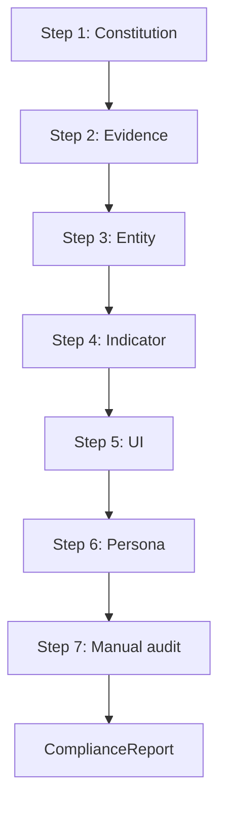

# CBAI Constitution Enforcement Framework

**Document ID:** CBAI-Enforcement-Framework-v1.0  
**Version:** 1.0.0  
**Status:** Official governance layer (definitions only)  
**Location:** `lib/governance/`

This framework is the **permanent governance layer** for the CBAI platform. It provides reusable rule definitions and compliance report types that future modules, auditors, and CI pipelines can consume.

**This is not:**

- Runtime validation
- A linter
- Automatic enforcement
- UI or API implementation

---

## Architecture

```
lib/governance/
├── types.ts                    # Core type system, GOVERNANCE_VERSION
├── index.ts                    # Public exports
├── registry.ts                 # GOVERNANCE_RULE_REGISTRY + query helpers
├── constitution/
│   └── rules.ts                # 12 constitutional principles
├── evidence/
│   └── rules.ts                # Source, status, methodology rules
├── rules/
│   ├── entity.ts               # Country, company, university, future entities
│   ├── indicator.ts            # Lifecycle: planned → connected → verified → deprecated
│   ├── ui.ts                   # No fake KPI/charts/confidence/AI wording
│   ├── persona.ts              # Six persona value requirements
│   └── index.ts                # MODULE_RULES aggregate
├── validation/
│   ├── types.ts                # Validation flow contracts (no execution)
│   └── catalog.ts              # DEFAULT_VALIDATION_FLOW for future CI
└── reports/
    ├── types.ts                # ComplianceReport, RuleCheckResult
    └── factory.ts              # Report templates and merge helpers
```

### Relationship to standards

| Layer | Location | Role |
|-------|----------|------|
| Standards | `docs/standards/` | Human-readable engineering specifications |
| Enforcement | `lib/governance/` | Machine-readable rule definitions derived from standards |
| Indicator registry | `lib/indicator-framework/` | Indicator catalog governed by indicator rules |
| Application | `app/`, `components/` | Implementation — not modified by this framework |

---

## Rule hierarchy

Rules are ordered by authority:

```
1. Constitution Rules (12 principles)     ← supreme
2. Evidence Rules (source, status, methodology)
3. Entity Rules (per entity type)
4. Indicator Rules (lifecycle + registry)
5. UI Rules (presentation constraints)
6. Persona Rules (six audience requirements)
```

Each rule includes:

| Field | Purpose |
|-------|---------|
| `id` | Stable identifier for reports and CI |
| `category` | Rule hierarchy level |
| `severity` | `critical` \| `major` \| `minor` |
| `allowed` | Permitted patterns |
| `forbidden` | Violations to detect in future validation |
| `standardReference` | Link to `docs/standards/` document |

---

## Rule categories

### 1. Constitution rules (12)

Evidence First · Political Neutrality · Human Benefit · Transparency · Golden Rule · Methodology Before Metrics · Separation of Evidence and Judgment · No Social Sentiment Scoring · Zero Demo Policy · Platform Consistency · Explain Before Evaluate · No Fake Data

### 2. Entity rules

Countries (Golden Rule reference) · Companies · Universities · Government · Investor · Person · Institution · Adapter single-source

### 3. Indicator rules

Lifecycle: `planned` → `connected` → `verified` → `deprecated`  
Plus: registry-only, no-scores-in-registry, methodology-block-required

### 4. Evidence rules

Source required · Status required · Methodology required · Verification gate · Local registry scope · Deprecated handling

### 5. UI rules

No fake KPI · No fake charts · No fake confidence · No AI wording · Accessibility required · Status badge consistency · No decorative controls

### 6. Persona rules

Citizen · Investor · Government · Student · Researcher · Academic · All six required

---

## Validation flow

The framework defines **what** future validation will check — not **how** to execute it.



| Step | Integration target | Categories |
|------|-------------------|------------|
| 1 Constitution | Pre-release gate | constitution |
| 2 Evidence | CI pipeline | evidence |
| 3 Entity | GitHub Actions | entity |
| 4 Indicator | CI pipeline | indicator |
| 5 UI | GitHub Actions | ui |
| 6 Persona | Pre-release gate | persona |
| 7 Manual audit | Human reviewer | all |

Access: `DEFAULT_VALIDATION_FLOW` from `@/lib/governance`.

---

## Compliance reports

Reusable report type for manual audits and future automation:

```typescript
import {
  createComplianceReportTemplate,
  GOVERNANCE_RULE_REGISTRY,
  summarizeComplianceReport,
} from "@/lib/governance";

const report = createComplianceReportTemplate({
  moduleId: "companies",
  moduleName: "Companies Module",
  targetRoute: "/companies",
});

// Future: validator populates passedRules, failedRules, warnings
// Manual: auditor merges results via mergeRuleResultsIntoReport()
```

| Field | Description |
|-------|-------------|
| `overallStatus` | compliant \| non_compliant \| partial \| not_evaluated |
| `passedRules` | RuleCheckResult[] with status passed |
| `failedRules` | RuleCheckResult[] with status failed |
| `warnings` | RuleCheckResult[] with status warning or skipped |
| `recommendations` | Action items (see STANDARD_RECOMMENDATIONS) |

---

## Future CI/CD integration

**Not implemented.** Planned integration points:

1. **CI pipeline** — Run evidence and indicator rule checks on `lib/` and route manifests
2. **GitHub Actions** — PR comment with compliance report summary per changed route
3. **Pre-release gate** — Block release if critical constitution or persona rules fail
4. **Forbidden pattern scanner** — Static text scan for confidence percentages, ranking copy

Example future workflow (illustrative):

```yaml
# .github/workflows/constitution-check.yml (future)
# - Import ALL_GOVERNANCE_RULES
# - Run custom validator against changed files
# - Emit ComplianceReport artifact
# - Fail on critical failures
```

---

## Future GitHub Actions integration

| Action | Purpose |
|--------|---------|
| `constitution-audit` | Generate report template per changed route |
| `forbidden-pattern-scan` | Detect fake confidence, ranking keywords |
| `persona-checklist` | Verify six persona IDs referenced in module |
| `standards-drift` | Compare rule version against docs/standards version |

All actions will import from `@/lib/governance` — no duplicate rule definitions.

---

## Future pre-release validation

Before any module ships:

1. Create `ComplianceReport` from template
2. Execute validation steps 1–6 (future automated)
3. Complete step 7 manual audit sign-off
4. Attach report to release notes or PR
5. `overallStatus` must be `compliant` or `partial` with zero critical failures

---

## Usage

```typescript
import {
  GOVERNANCE_VERSION,
  getRegistrySummary,
  getRulesByCategory,
  getConstitutionRuleByPrinciple,
  createComplianceReportTemplate,
} from "@/lib/governance";

const summary = getRegistrySummary();
// { totalRules: 44, criticalRules: 28, ... }

const goldenRule = getConstitutionRuleByPrinciple("golden-rule");
const entityRules = getRulesByCategory("entity");
```

---

## Verification

| Check | Result |
|-------|--------|
| Runtime validation | None — definitions only |
| Application code modified | No |
| `lib/intelligence/` modified | No |
| `npm run lint` | Required pass |
| `npm run build` | Required pass |
| Version | `1.0.0` |

---

## Registry summary (v1.0.0)

| Category | Rules |
|----------|-------|
| Constitution | 12 |
| Evidence | 6 |
| Entity | 8 |
| Indicator | 7 |
| UI | 7 |
| Persona | 7 |
| **Total** | **47** |

---

## Cross-references

- [CBAI Standards Suite](./standards/README.md)
- [Global Indicator Framework](./global-indicator-framework.md)
- [CBAI Constitution v1](./CBAI-Constitution-v1.md)
