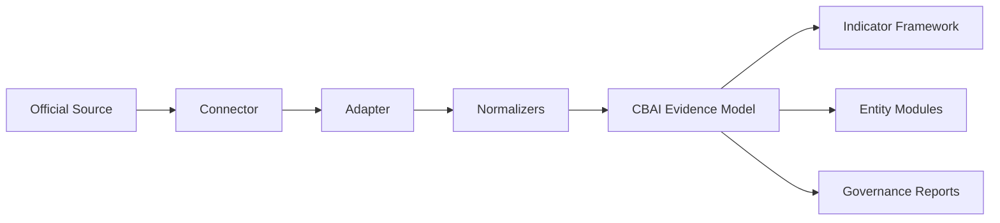

# CBAI Evidence Infrastructure

**Document ID:** CBAI-Evidence-Infrastructure-v1.0  
**Version:** 1.0.0  
**Status:** Official architecture (definitions only)  
**Location:** `lib/evidence-infrastructure/`

Permanent architecture for connecting **official evidence sources** to the CBAI platform. This is not data collection, API integration, or scraping.

**Explicitly excluded:**

- HTTP / fetch
- API clients
- Credentials or API keys
- Web scraping
- Runtime execution

---

## Architecture

```
lib/evidence-infrastructure/
├── types.ts                      # Core type system, INFRASTRUCTURE_VERSION
├── index.ts                      # Public exports
├── sources/
│   └── catalog.ts                # Official source records (registered once)
├── connectors/
│   └── catalog.ts                # Connector contracts (metadata, health, version)
├── adapters/
│   └── catalog.ts                # Adapter contracts (external → CBAI Evidence Model)
├── normalizers/
│   └── catalog.ts                # Date, unit, country, language, currency, classification
├── contracts/
│   ├── evidence-model.contract.ts
│   ├── connector.contract.ts
│   ├── adapter.contract.ts
│   └── index.ts
├── registry/
│   └── index.ts                  # EVIDENCE_INFRASTRUCTURE_REGISTRY
└── versioning/
    └── manifest.ts               # Schema v1, v2, v3 evolution
```

### Data flow (future)



**Today:** Catalogs and contracts only. One connected source: `cbai-local-registry`.

---

## Lifecycle

### Source connection status

| Status | Meaning |
|--------|---------|
| `planned` | Source registered; connector not built |
| `connected` | Connector contract active; evidence path defined |
| `deprecated` | Source retired; historical provenance retained |

### Verification status

| Status | Meaning |
|--------|---------|
| `not_started` | No validation attempted |
| `verification_pending` | Data received; validation incomplete |
| `verified` | Passed validation checklist |
| `failed` | Validation failed — do not promote |
| `not_applicable` | Local registry without external verification |

### Indicator binding

Each source declares `supportedIndicators` — slugs from `lib/indicator-framework/`. Indicators are never invented at connection time.

---

## Source model

Every official source defines:

| Field | Description |
|-------|-------------|
| `id` | Stable identifier |
| `slug` | URL-safe key (aligns with indicator-framework sources) |
| `name` | Display name |
| `organization` | Publishing organization |
| `officialWebsite` | Canonical URL |
| `coverage` | Geographic and thematic scope |
| `supportedIndicators` | Indicator slugs this source can supply |
| `updateFrequency` | Expected publication cadence |
| `license` | Data license terms |
| `connectionStatus` | planned \| connected \| deprecated |
| `verificationStatus` | Verification lifecycle state |

### Registered sources (v1.0.0)

| Source | Connection | Verification |
|--------|------------|--------------|
| United Nations | Planned | not_started |
| World Bank | Planned | not_started |
| IMF | Planned | not_started |
| WHO | Planned | not_started |
| UNESCO | Planned | not_started |
| ILO | Planned | not_started |
| ITU | Planned | not_started |
| OECD | Planned | not_started |
| Open Contracting Partnership | Planned | not_started |
| National Statistics Offices | Planned | not_started |
| Official Procurement Portals | Planned | not_started |
| National Open Budget Portals | Planned | not_started |
| **CBAI Local Platform Registry** | **Connected** | **verified** |

---

## Connector model

Every future connector exposes:

| Surface | Purpose |
|---------|---------|
| `metadata` | connectorId, sourceSlug, title, maintainer, documentationUrl |
| `health` | status, lastCheckedAt, message |
| `version` | Connector semver |
| `supportedEntities` | country, company, university, government, institution |
| `supportedIndicators` | Indicator slugs |
| `schemaVersion` | Evidence schema emitted |

No network calls in this framework — health defaults to `unknown` with explicit message.

---

## Adapter model

Adapters transform **external structure → CBAI Evidence Model**.

Pipeline stages (declarative):

1. **ingest** — receive external payload (future)
2. **validate** — schema check against source format
3. **normalize** — apply normalizer catalog
4. **map-to-evidence-model** — produce `CbaiEvidenceItem`
5. **attach-provenance** — source, license, verification status

### Forbidden adapter outputs

Scores · Rankings · Percentages · Confidence · AI summaries · Sentiment

---

## Normalizer catalog

| Kind | Normalizer | Standard |
|------|------------|----------|
| `date` | ISO 8601 Date | ISO 8601 |
| `unit` | SI Unit | SI Brochure |
| `country-code` | ISO 3166 alpha-2 | ISO 3166-1 |
| `language` | ISO 639-1 | ISO 639-1 |
| `currency` | ISO 4217 alpha-3 | ISO 4217 |
| `classification` | ISIC Rev.4 / ISCED 2011 | UN ISIC / UNESCO ISCED |

---

## CBAI Evidence Model (v1)

```typescript
type CbaiEvidenceItem = {
  id: string;
  schemaVersion: "v1" | "v2" | "v3";
  sourceId: string;
  sourceSlug: string;
  indicatorSlug: string;
  entityType: SupportedEntityType;
  entityId: string;
  fieldKey: string;
  value: EvidenceValue;       // text | number | boolean | date | code | reference | unavailable
  provenance: EvidenceProvenance;
  normalizedBy: NormalizerKind[];
  infrastructureVersion: "1.0.0";
};
```

Every item requires provenance: `sourceId`, `sourceSlug`, `license`, `verificationStatus`.

---

## Registry

`EVIDENCE_INFRASTRUCTURE_REGISTRY` aggregates:

- 13 official sources
- 5 connector contracts
- 8 adapter contracts
- 7 normalizers

Query helpers:

```typescript
import {
  EVIDENCE_INFRASTRUCTURE_REGISTRY,
  getInfrastructureSummary,
  getSourceAdapterChain,
  getSourceBySlug,
} from "@/lib/evidence-infrastructure";

const chain = getSourceAdapterChain("world-bank");
// { source, connectors, adapters }
```

---

## Versioning

| Schema | Status | Notes |
|--------|--------|-------|
| **v1** | Active | Current evidence model |
| **v2** | Planned | Temporal windows, multi-source provenance, document attachments |
| **v3** | Planned | Cross-entity bundles, attestation, tenant private evidence |

`isCompatibleSchema(from, to)` supports migration planning.

Infrastructure semver: `INFRASTRUCTURE_VERSION = "1.0.0"`.

---

## Future APIs

**Not implemented.** Planned REST resources (see `docs/standards/11-api-standard.md`):

| Endpoint | Returns |
|----------|---------|
| `GET /v1/evidence/sources` | Source catalog with connection status |
| `GET /v1/evidence/sources/{slug}` | Source + connector + adapter chain |
| `GET /v1/evidence/items` | CbaiEvidenceItem[] with provenance wrappers |
| `GET /v1/evidence/normalizers` | Normalizer catalog |

GraphQL: `EvidenceSource`, `Connector`, `Adapter`, `EvidenceItem` types mirroring this registry.

SDK: `@cbai/sdk` evidence namespace generated from OpenAPI — no hand-maintained parallel types.

---

## Relationship to other frameworks

| Framework | Relationship |
|-----------|--------------|
| `lib/indicator-framework/` | Indicators declare required sources; infrastructure registers sources |
| `lib/governance/` | Evidence rules govern what connected sources may display |
| `docs/standards/02-evidence-standard.md` | Human-readable evidence standard |
| `lib/intelligence/` | **Not modified** — future adapter wiring only |

---

## Verification

| Check | Result |
|-------|--------|
| HTTP / fetch / API / credentials | None |
| `lib/intelligence/` modified | No |
| UI modified | No |
| `npm run lint` | Required pass |
| `npm run build` | Required pass |
| Version | 1.0.0 |

---

## Registry summary (v1.0.0)

| Artifact | Count |
|----------|-------|
| Official sources | 13 |
| Connected sources | 1 |
| Connector contracts | 5 |
| Adapter contracts | 8 |
| Normalizers | 7 |
| Active schema | v1 |
