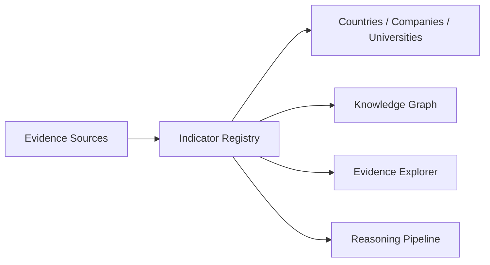

# CBAI Global Indicator Framework

Constitutional foundation for all future CBAI intelligence. This framework is a **standardized indicator registry** — not a scoring engine, AI model, or ranking system.

## Principles

| Principle | Application |
|-----------|-------------|
| Evidence First | Every indicator declares required and optional evidence sources |
| Political Neutrality | No opinion surveys or advocacy scores in the registry |
| Transparency | Methodology, status, and missing evidence are explicit |
| Explain Before Evaluate | `methodology` blocks document why and how before any future evaluation |
| Zero Demo Policy | No fabricated scores, percentages, rankings, or AI summaries |

## Architecture

```
lib/indicator-framework/
├── types.ts                 # Core type system and FRAMEWORK_VERSION
├── index.ts                 # Public exports
├── registry.ts              # Aggregated GLOBAL_INDICATOR_REGISTRY + query helpers
├── domains/
│   └── catalog.ts           # 22 domain definitions
├── indicators/
│   └── catalog.ts           # Indicator definitions (grouped by theme)
├── sources/
│   └── registry.ts          # Evidence source registry (no API connections)
├── personas/
│   └── mapping.ts           # Persona value mapping
└── integration/
    └── future.ts            # Future integration targets (planned only)
```

### Data flow (future)



**Not implemented:** API connections, scoring, rankings, or entity binding.

## Indicator schema

Every indicator contains:

| Field | Description |
|-------|-------------|
| `id` | Stable identifier |
| `slug` | URL-safe key |
| `title` | Human-readable name |
| `description` | What the indicator measures |
| `category` | Domain ID |
| `methodology` | Why it exists, required evidence, missing evidence, future scoring derivation |
| `requiredEvidenceSources` | Source slugs (required) |
| `optionalEvidenceSources` | Source slugs (optional) |
| `status` | `connected` \| `not_connected` \| `planned` |
| `applicableEntities` | `country`, `company`, `university`, `government`, `institution` |
| `version` | Framework version (`1.0.0`) |

## Domain catalog

22 domains — each defines purpose, scope, evidence expectations, and future expansion.

| Domain | Purpose summary |
|--------|-----------------|
| Governance | Institutional governance from public records |
| Economy | Macroeconomic conditions from official statistics |
| Human Rights | Treaty and UN mechanism reporting |
| Education | Enrollment, literacy, accreditation |
| Research | Bibliometric and R&D evidence |
| Innovation | Patents, R&D surveys, technology transfer |
| Infrastructure | Transport, utilities, connectivity assets |
| Environment | Monitoring agency datasets |
| Energy | Energy balances and capacity |
| Health | WHO and national health statistics |
| Employment | ILO and labour force surveys |
| Digital Development | ITU and regulator statistics |
| Public Procurement | Tender and award disclosure |
| Budget Transparency | Open budget document publication |
| Judicial System | Court structure and legal framework |
| Public Services | Administrative service coverage |
| Trade | Customs and trade flow statistics |
| Investment | FDI and balance of payments |
| Industry | ISIC/NAICS classification |
| Agriculture | FAO and national agricultural statistics |
| Climate | NDC and GHG inventory evidence |
| Disaster Preparedness | Sendai Framework reporting |

## Source catalog

Evidence sources are declared only — **no API connections**.

| Source | Status |
|--------|--------|
| United Nations | Not Connected |
| World Bank | Not Connected |
| IMF | Not Connected |
| WHO | Not Connected |
| UNESCO | Not Connected |
| ILO | Not Connected |
| ITU | Not Connected |
| OECD | Not Connected |
| Open Contracting Partnership | Not Connected |
| National Statistics Offices | Not Connected |
| Official Procurement Portals | Not Connected |
| National Open Budget Portals | Not Connected |
| CBAI Local Platform Registry | **Connected** |

## Methodology

Each indicator's `methodology` block explains:

1. **Why it exists** — business and constitutional rationale
2. **Required evidence** — what must be connected before evaluation
3. **Missing evidence** — current gaps (honest status)
4. **Future scoring derivation** — how a score *could* be derived later, without implementing scoring

## Persona mapping

| Persona | Indicator value |
|---------|-------------------|
| Citizen | See which evidence categories exist and which remain unconnected |
| Investor | Identify fiscal, procurement, and investment indicator gaps before due diligence |
| Government | Prioritize official data publication using methodology and evidence gaps |
| Student | Understand education and research indicators for institutions |
| Researcher | Export definitions and source requirements for reproducible research |
| Academic | Cite methodology and evidence requirements in scholarly work |

## Future integration map

| Target | Status | Description |
|--------|--------|-------------|
| Countries | Planned | Bind applicable indicators with evidence status |
| Companies | Planned | Industry, trade, innovation indicators |
| Universities | Planned | Education and research indicators |
| Knowledge Graph | Planned | Indicator-derived edges with provenance |
| Evidence Explorer | Planned | Browse indicators, sources, connection status |
| Reasoning | Planned | Consume evidence items — not fabricated scores |
| Decision Intelligence | Planned | Cite indicator IDs and source provenance |
| Mobile | Planned | Registry browsing on mobile clients |
| API | Planned | Versioned programmatic registry access |

## Usage

```typescript
import {
  GLOBAL_INDICATOR_REGISTRY,
  getIndicatorBySlug,
  getIndicatorsByDomain,
  getRegistrySummary,
} from "@/lib/indicator-framework";

const summary = getRegistrySummary();
// { version, domainCount, indicatorCount, sourceCount, connectedIndicators, ... }
```

## Verification

| Check | Result |
|-------|--------|
| `lib/intelligence/` | Not modified |
| `runtime/`, `agents/`, `reasoning/` | Not modified |
| No scores, rankings, percentages | Confirmed |
| No API connections | Confirmed |
| Strong typing | TypeScript strict |
| Version | `1.0.0` |
| Lint | Run `npm run lint` |
| Build | Run `npm run build` |

## Registry summary (v1.0.0)

- **Domains:** 22
- **Indicators:** 22 (one seed indicator per domain)
- **Sources:** 13 (1 connected: CBAI Local Platform Registry)
- **Personas:** 6
- **Future integration targets:** 9
