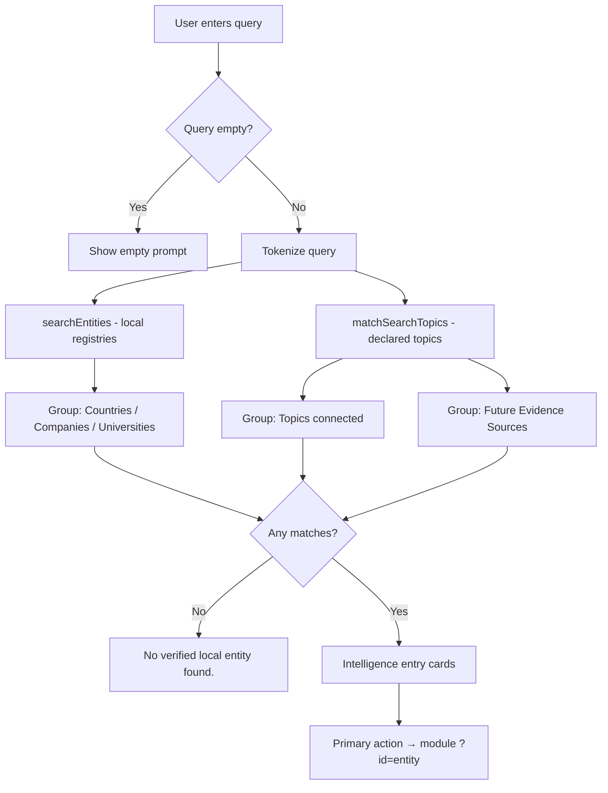

# Search Gateway Report

**Phase:** Platform Evolution Phase 2  
**Date:** July 6, 2026  
**Route:** `/search`  
**Scope:** Platform experience only — no changes to `lib/intelligence/*`, runtime, agents, reasoning, orchestrator, evidence engine, or Cloudflare static export.

---

## Summary

`/search` is now the **CBAI Global Intelligence Gateway** — a routing layer that helps users understand where topics belong inside the platform. Search reads only local country, company, and university registries plus explicitly mapped topic areas. It does not invent entities, guess intent, or fabricate intelligence.

---

## Before vs After

| Dimension | Before | After |
|-----------|--------|-------|
| **Purpose** | Generic “Global Intelligence Search” with AI styling | Primary platform entry — topic routing and intelligence entry |
| **Hero** | Animated ping, fake “indexed entities” feel, suggestion chips as live autocomplete | Large search field, constitutional explanation, example search links (no autocomplete) |
| **Results** | Flat list with AI/Invest/Risk scores | Grouped: Countries, Companies, Universities, Topics, Future Evidence Sources |
| **Result cards** | Relevance score + fabricated score cells | Entity, Type, Evidence Status, Available Intelligence, Missing Evidence, Primary Action |
| **Empty state** | “No results found” | “No verified local entity found.” with honest detail |
| **Sidebar** | Score filters + AI Insight panel (91.3% confidence) | Removed — trust and principles sections instead |
| **Quick access** | None | Nine clickable categories with honest not-connected labels |
| **Search logic** | Empty query showed all entities ranked by AI score | Empty query returns nothing; no score boosting |
| **Design** | Dashboard card style | Matches home page: `.home-page`, `.home-surface`, `HomeSection`, `HomeModuleIcon` |

---

## Created Files

| File | Purpose |
|------|---------|
| `lib/search-gateway.ts` | Gateway content, topic registry, grouped search execution, i18n-ready locale list |
| `lib/search-intelligence-entry.ts` | Intelligence entry metadata for entity and topic result cards |
| `components/search/gateway/SearchGateway.tsx` | Page orchestrator (sections layout) |
| `components/search/gateway/SearchGatewayClient.tsx` | Client query sync for static export (`?q=` via URL) |
| `components/search/gateway/SearchGatewayHero.tsx` | Hero, native GET form, example search links |
| `components/search/gateway/SearchGatewayResults.tsx` | Grouped results and empty states |
| `components/search/gateway/SearchIntelligenceCard.tsx` | Intelligence entry card (6 fields) |
| `components/search/gateway/SearchQuickAccess.tsx` | Quick access category grid |
| `components/search/gateway/SearchPrinciples.tsx` | Four constitutional search principles |
| `components/search/gateway/SearchTrust.tsx` | Trust explanation block |
| `docs/search-gateway-report.md` | This report |

---

## Modified Files

| File | Change |
|------|--------|
| `lib/global-search.ts` | Removed AI score boosting; empty query returns `[]`; score filters no longer gate results; added `getEntityDetailHref()`; constitutional `generateSearchInsight()` |
| `app/(dashboard)/search/page.tsx` | Renders `SearchGatewayClient` |
| `app/globals.css` | `.home-search-input` styles aligned with home hero |

---

## Deleted Files

| File | Reason |
|------|--------|
| `components/search/GlobalSearchBox.tsx` | Fake suggestions, animated “live” indicator, autocomplete chips |
| `components/search/SearchFilters.tsx` | Score-based filters (AI, investment, risk) |
| `components/search/SearchInsightPanel.tsx` | Fake AI insight and hardcoded confidence |
| `components/search/SearchResults.tsx` | Replaced by grouped gateway results with intelligence entry cards |

---

## Architecture

```
lib/search-gateway.ts              ← content, topics, executeGatewaySearch()
lib/search-intelligence-entry.ts   ← card field mapping (platform layer)
lib/global-search.ts               ← local registry token search (shared index)

app/(dashboard)/search/page.tsx
  └── SearchGatewayClient          ← reads ?q= (static export compatible)
        └── SearchGateway
              ├── SearchGatewayHero        ← native GET form
              ├── SearchGatewayResults     ← grouped entities + topics
              ├── SearchQuickAccess        ← category shortcuts
              ├── SearchPrinciples         ← constitutional rules
              └── SearchTrust              ← evidence transparency
```

**Static export:** Search results execute client-side from URL `?q=` via `useSyncExternalStore`. Native form GET triggers full navigation; home hero search continues to work without JavaScript for submission.

**Multilingual readiness:** All user-facing strings live in `lib/search-gateway.ts` with `SEARCH_GATEWAY_LOCALES` registry — ready for locale bundles without component changes.

---

## Search Flow



### Example routing

| Query | Result |
|-------|--------|
| Japan | Country entity → `/countries?id=…` |
| Harvard | University entity → `/universities?id=…` |
| NVIDIA | Company entity → `/companies?id=…` |
| Toyota | No local entity (not in catalog) → honest empty state |
| Public Procurement | Future Evidence Sources → not connected |
| Human Rights | Future Evidence Sources → not connected |
| Governance | Topics → Countries module |
| Education | Topics → Universities module |
| Renewable Energy / Water | Future Evidence Sources → environment module planned |

---

## Constitution Compliance

| Rule | Implementation |
|------|----------------|
| Evidence First | Every card shows evidence status before action |
| No Fake Data | No scores, percentages, or trending on search page |
| No Fake AI | Removed insight panel, autocomplete, and AI readiness patterns |
| No Fake Suggestions | Example searches are static links, not live predictions |
| Transparency | Missing evidence explicitly labeled on every card |
| Political Neutrality | Topic routing only — no editorial ranking |
| Human Benefit | Routes users to verified modules; planned areas marked honestly |

**Untouched:** `lib/intelligence/*`, runtime, agents, reasoning, orchestrator, evidence engine.

---

## Persona Benefits

| Persona | Benefit |
|---------|---------|
| **Citizen** | Quickly find if a country or governance topic has connected evidence |
| **Investor** | See investment topic maps to planned module — no fake market scores |
| **Government** | Governance queries route to country registry with honest limits |
| **Student** | Education routes to university catalog; Harvard/Japan examples work |
| **Researcher** | Entity cards show available vs missing evidence before opening modules |
| **Academic** | Topic groups clarify which domains are catalog-backed vs planned |

---

## Mobile Readiness

| Area | Implementation |
|------|----------------|
| **Responsive layout** | `max-w-6xl`, stacked sections, 1→2 column result grid |
| **Touch targets** | `min-h-11` submit button, `min-h-[4.5rem]` quick access cards |
| **iOS / Android** | Native `type="search"` input; form GET works without hydration |
| **Keyboard** | Focus rings on all interactive elements; semantic headings |
| **Tablet** | 2-column principles and results at `sm`/`lg` breakpoints |

---

## Verification

```bash
npm run lint   # ✓ passed
npm run build  # ✓ passed — /search remains ○ Static (18 pages)
```

**No git commit** — per mission instructions.

---

## Summary

The Global Intelligence Gateway transforms search from a dashboard widget into the platform’s primary routing layer. Users typing concepts like Japan, Harvard, Public Procurement, or Renewable Energy immediately see which CBAI module owns that topic, what evidence exists today, and what remains unconnected — with no invented results or AI narratives.
