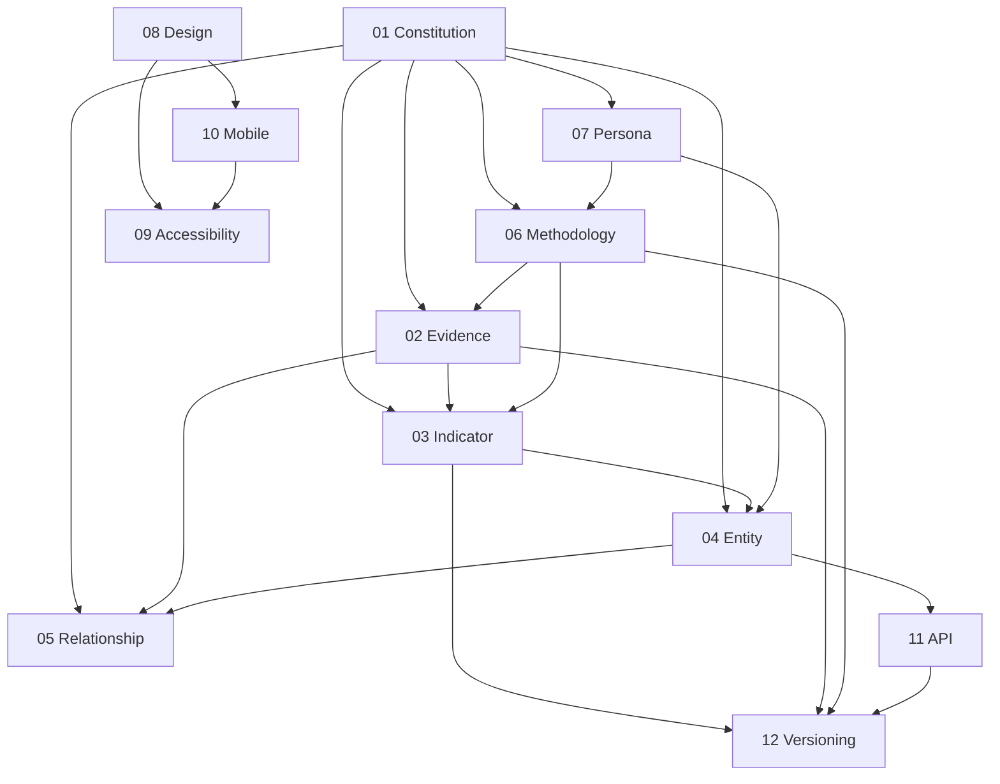

# CBAI Constitutional Standard v1.0

**Document suite:** CBAI-Standards-v1.0  
**Status:** Official engineering standard (documentation only)  
**Effective:** July 2026  
**Authority:** Permanent — supersedes ad hoc conventions unless explicitly amended

This directory is the **permanent engineering standard** for the CBAI platform. Everything built in the future must follow these standards. They are not application code; they govern how application code, data, design, and APIs are conceived and shipped.

---

## How the standards connect

| Standard | Role in the stack |
|----------|-------------------|
| [01 — Constitution](./01-cbai-constitution.md) | Supreme principles; all other standards derive authority here |
| [02 — Evidence](./02-evidence-standard.md) | What may be shown as fact; source lifecycle and verification |
| [03 — Indicator](./03-indicator-standard.md) | Measurable evidence categories; never invented ad hoc |
| [04 — Entity](./04-entity-standard.md) | Countries, companies, universities, institutions — normalized shapes |
| [05 — Relationship](./05-relationship-standard.md) | Typed edges between entities; evidence-backed only |
| [06 — Methodology](./06-methodology-standard.md) | Explain before evaluate; separation of evidence and judgment |
| [07 — Persona](./07-persona-standard.md) | Six audience lenses; honest value per persona |
| [08 — Design](./08-design-standard.md) | Visual and layout discipline across surfaces |
| [09 — Accessibility](./09-accessibility-standard.md) | WCAG AA, keyboard, screen readers, contrast, ARIA |
| [10 — Mobile](./10-mobile-standard.md) | iOS, Android, responsive web, offline readiness |
| [11 — API](./11-api-standard.md) | Future REST, GraphQL, SDK contracts |
| [12 — Versioning](./12-versioning-standard.md) | Semantic versioning for platform, indicators, methodology |
| [13 — Product Engineering Mode](./13-product-engineering-mode.md) | Permanent 80/20 development ratio; usability, consistency, polish, performance before new capability |

---

## Reading order

**For engineers shipping features:** 01 → 13 → 04 → 02 → 03 → 06 → 05 → 07 → 08 → 09 → 12

**For design and mobile:** 01 → 08 → 09 → 10 → 07

**For API and integration:** 01 → 02 → 03 → 04 → 11 → 12

---

## Compliance

A feature is **constitution-compliant** when it satisfies:

1. All applicable rules in documents 01–07 (data and intelligence)
2. Documents 08–09 when user-facing
3. Document 10 when targeting mobile or responsive breakpoints
4. Documents 11–12 when exposing or versioning public contracts

Compliance reports (e.g. per-route audits) reference this suite by document ID and version.

---

## Amendment process

1. Propose change with rationale and affected documents
2. Bump standard version (see [12 — Versioning](./12-versioning-standard.md))
3. Update cross-references in this README
4. Record effective date; do not retroactively rewrite shipped audit history

---

## Related documents (outside this suite)

| Document | Relationship |
|----------|--------------|
| `docs/CBAI-Constitution-v1.md` | Historical ratified architecture baseline; standards v1.0 operationalizes its principles |
| `docs/CBAI-Domain-Model-v1.md` | Ontology reference; entity and relationship standards align |
| `docs/global-indicator-framework.md` | Implementation of indicator standard in `lib/indicator-framework/` |
| `docs/brand/cbai-brand-foundation.md` | Brand visual spec; design standard references |

---

## Verification

| Check | Expectation |
|-------|-------------|
| Application code | Not modified by this suite |
| Lint / build | Must pass after docs-only changes |
| Scores in standards | None — standards describe rules, not rankings |
