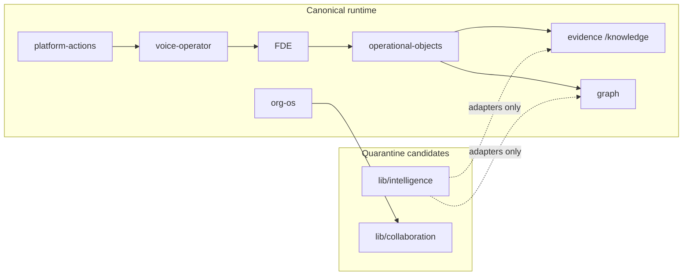

# Architecture map — Stage 1 ownership + Stage 2 targets

**Branch:** `preview/spatial-world-intelligence`
**Recorded:** 2026-07-22
**Stage 1:** COMPLETE (contracts only — see `docs/architecture/product-census/stage-1/STAGE-1-FINAL-REPORT.md`)
**Stage 2:** PLANNED — not started; awaiting human approval

---

## Stage 1 — canonical ownership (live)

| Concern | Owner module(s) | Primary route(s) | Contract / test |
|---------|-----------------|------------------|-----------------|
| **platform-actions** | `lib/platform-actions/*` | All typed + voice navigation | `lib/canonical-contracts/actions.ts`; `test:voice-command-orchestrator` |
| **voice-operator** | `lib/voice-operator/*`, `components/voice-operator/*` | Global dock (layout) | `auth-action-policy.ts`; `test:voice-operating-navigator`, `test:voice-platform-operator` |
| **FDE** (forward-deployed engines) | `lib/forward-deployed-engines/*`, `components/forward-deployed/*` | `/`, entities, `/research`, `/knowledge`, `/graph`, `/governance`, `/my-work`, `/reports`, `/government` | `test:ontology-forward-deployed-engines` |
| **org-os** | `lib/organization-os/*` | `/organization` | `0005`–`0007` migrations (SQL only); SF-2/SF-4 |
| **operational-objects** | `lib/operational-objects/*`, composer in layout | `/my-work`, global composer | `test:operational-objects` |
| **evidence** | `lib/evidence-explorer.ts`, `components/evidence/*` | `/knowledge` (canonical; no `/evidence` page) | `lib/canonical-contracts/evidence.ts` |
| **graph** | `lib/graph/*`, `lib/living-object-network/*` | `/graph` | `lib/canonical-contracts/graph.ts` |
| **intelligence-os** (shell context) | `lib/intelligence-os/*` | Shell-wide mission context | ≠ quarantined `lib/intelligence` |
| **identity / locale** | `lib/canonical-contracts/identity.ts`, `locale.ts` | All routes | `test:canonical-contracts`, `test:localization-closure` |
| **trust / SF blockers** | `lib/canonical-contracts/trust.ts` | Auth collab publish surfaces | SF-1…5 encoded `productionBlocker: true` |

### Dependency rule (enforced)

Zero orphan `@/lib/intelligence` imports from: `app/`, `components/`, `lib/platform-actions/`, `lib/voice-operator/`, `lib/forward-deployed-engines/`, `components/forward-deployed/`.

**Verifier:** `scripts/test-architecture-boundaries.ts` → **PROVEN_AUTOMATED** PASS.

---

## Quarantine (mark only — do not delete in Stage 1/Preview)

| Path | Role | Product import status | Stage 2 disposition |
|------|------|----------------------|---------------------|
| **`lib/intelligence/**`** | Legacy intelligence stack (~200 files) | **Zero** app/component imports | Archive behind adapters after import lint clean |
| **`lib/collaboration/**`** | Legacy collaboration stores | **Zero** component imports | Stop growth; migrate to org-OS (`collaborationToOrgOsAdapter`, `wired: false`) |

Markers: `lib/canonical-contracts/quarantine.ts`, JSDoc on quarantine entry points.

---

## Stage 2 — consolidation targets (not started)

From `docs/architecture/product-census/15-phased-implementation-plan.md` + DD-PC-005:

| Target | Action | Risk if rushed |
|--------|--------|----------------|
| Enforce voice + FDE orchestration | Single action registry; no parallel command store | S2-R1 |
| Wire compatibility adapters | Set `wired: true` incrementally with tests | Evidence type drift S2-R3 |
| org-OS owns teams/messages | Bind `/teams` drafts → org memberships | SF-2 dual model |
| Supabase RLS + object ACL | Apply migrations + IDOR suite on prod project | SF-4 EXTERNAL_BLOCKED |
| Publication rights object | Durable store + server gate | SF-5 |
| Physical quarantine | Move `lib/intelligence`, `lib/collaboration` to archive path | Requires separate deletion approval |

---

## Out-of-boundary live consumers (allowed, documented)

See `docs/architecture/product-census/stage-1/remaining-out-of-boundary-consumers.md`:

- Genesis UI → `lib/genesis`
- `/teams` → `cbai-team-drafts` (must bind org-OS later)
- PLACEHOLDER shells → `/files`, `/messages`, `/notifications`

---

## Verification cross-links

| Artifact | Path |
|----------|------|
| Route matrix | `01-route-capability-matrix.csv` |
| Risk register | `02-risk-register.md` |
| Migration plan | `05-migration-plan.md` |
| Design decisions | `04-design-decisions.md` |
| Stage 1 final report | `docs/architecture/product-census/stage-1/STAGE-1-FINAL-REPORT.md` |
